<div align="center">
  
</div>

# Welcome developer
Hello developer, I hope you're doing well! In this file, I will present to you my first Java project. Here's what this README will cover:
- The problem statement
- The database tables and classes used in the project
- How to use this application

What are we waiting for, let's start.


# Table of Contents
- [What is "ACHIFAA PHARMACY" application](#What-is-"ACHIFAA-PHARMACY"-application)
- [Database Tables and Classes](#database-tables-and-classes)
- [How to Use the Application](#how-to-use-the-application)


# What is "ACHIFAA PHARMACY" application
ACHIFAA PHARMACY is a desktop application developed by [Aymen Igri](https://www.linkedin.com/in/aymen-igri-8b6167304) using Java, JavaFX for the UI management, SceneBuilder for the UI creation, SQLite for the database management, JDBC for the connection between the Java code and the SQL database, and Maven for dependency management. The application is designed for pharmacists to manage the data of a pharmacy, including managing medications, clients, sales, prescriptions, reordering, and pharmacist data.

# Database Tables and Classes
## Database Tables:
<div align="center">
  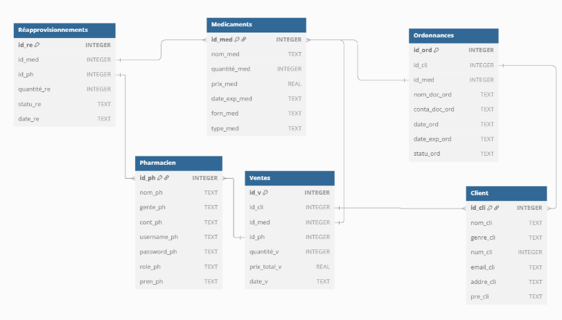
</div>

## Classes
- Data Classes
<div align="center">
  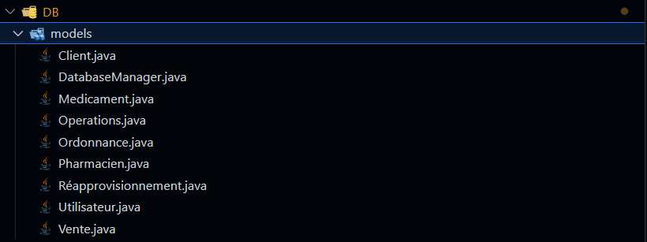
</div>

- UI classes
<div align="center">
  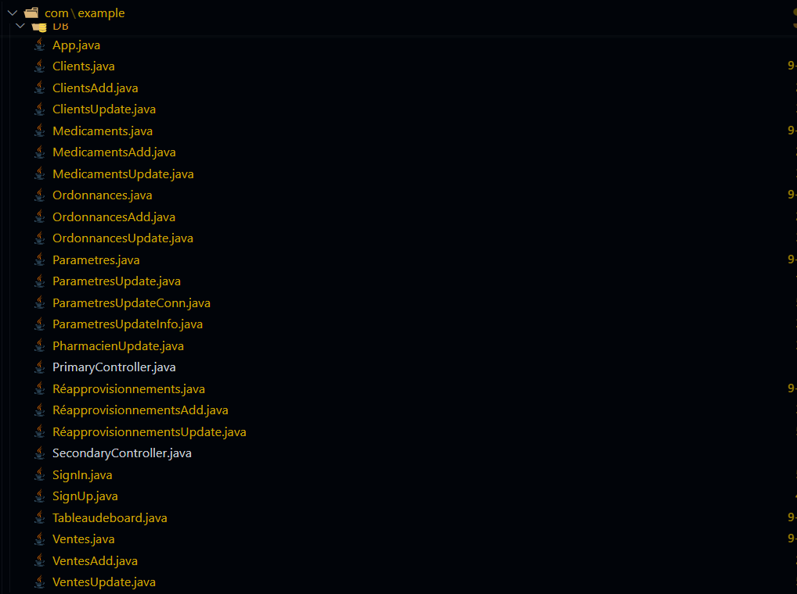
</div>

# How can i use this application?
After getting the files , you can use this command to install all the dependencies that i did use on this project (you should already be in the demomavinfx folder):
 ```bash
mvn clean install
```
After installing the dependencies , run the project using this commande:
 ```bash
mvn javafx:run 
```
And after that you'll be in the first page of the project, the connection page:
<div align="center">
  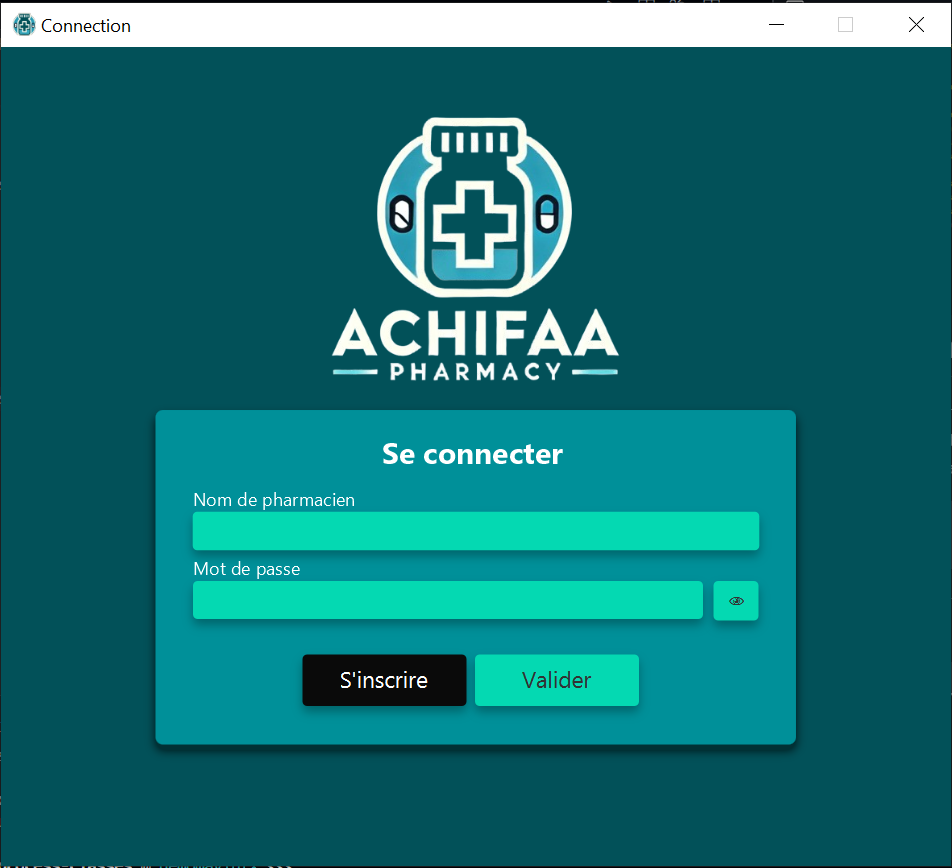
</div>
If you don't have an account u should create one after cliking on the "S'inscrire" button that will open the create account page:
<div align="center">
  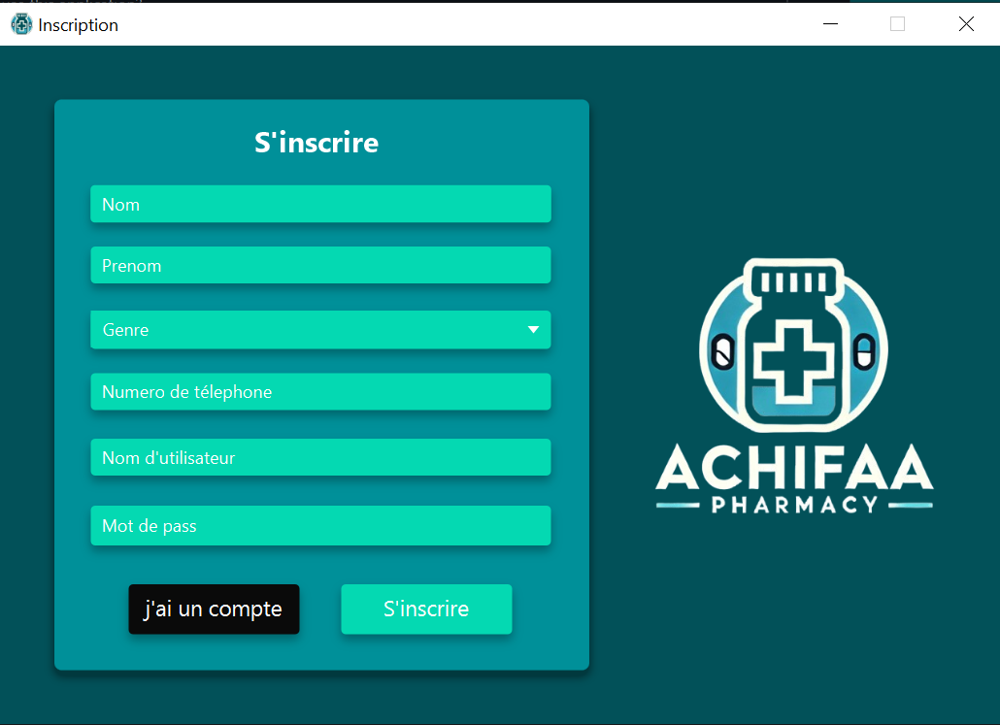
</div>
Worning: you should fill all the fields , and also use a unique username.

After creating your account use your information to connect with your account.
after that you'll get to the first page, the Dashboard:
<div align="center">
  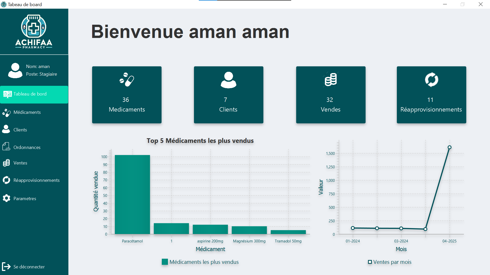
</div>
that shows the general information to give you an idea about your work.

After cliking on the medications page:
<div align="center">
  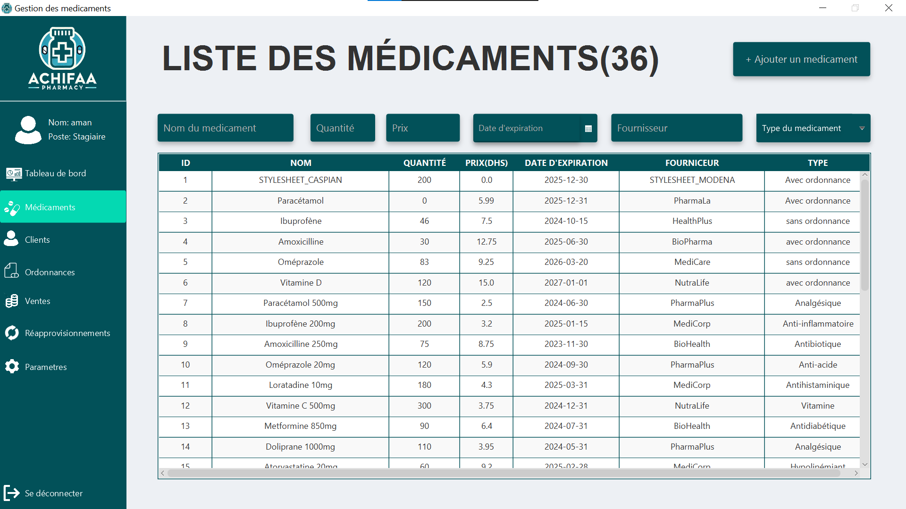
</div>

You'll see a the title with a number , the number is a counting of the element that we manage in this page , in this part it's the number of the medications exist in the database, becide the title u can see the Add button that give you the add option:
<div align="center">
  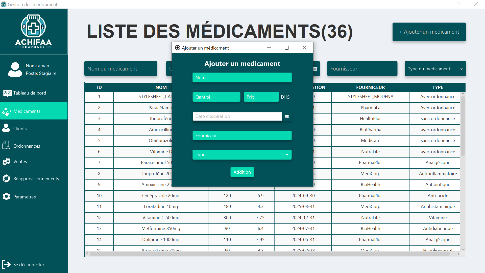
</div>

Under the title you'll see the search bar:
<div align="center">
  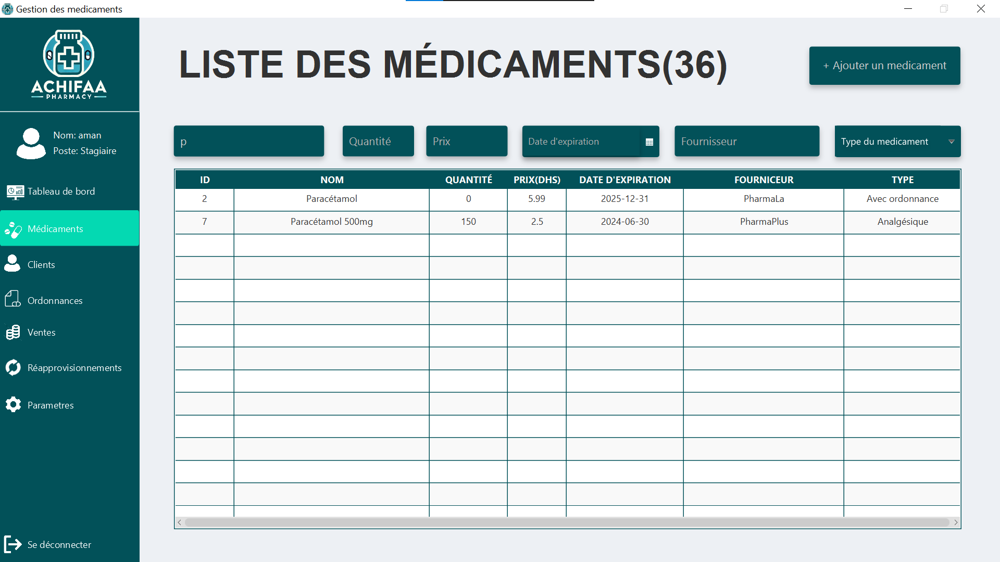
</div>

Under the search bar you'll see the medications table, if you wanna update a medications data, you can click on the medication that you want to modify and it will open the page of the modification as you can see:
<div align="center">
  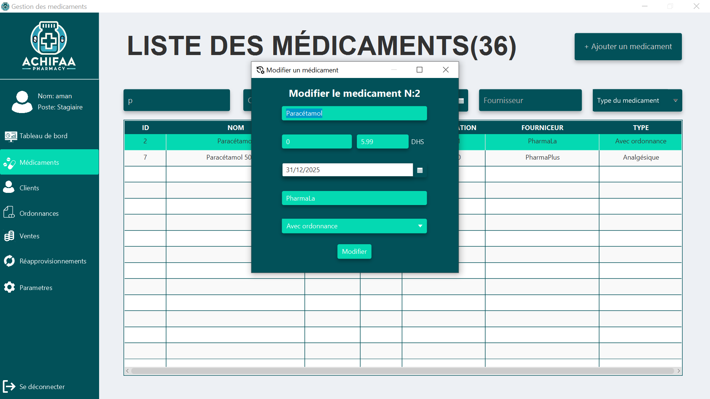
</div>

That's for the medications page , it's the same thing for the other page, fell free to descover them.

About the last page, the settings page as u can see:
<div align="center">
  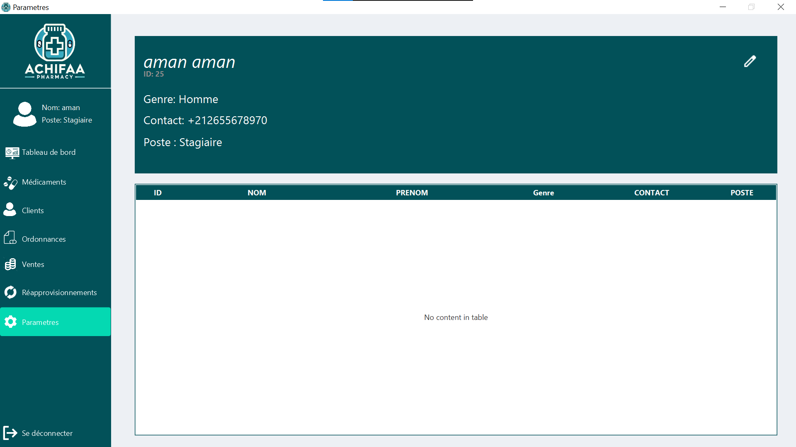
</div>

It will show u your informations u can modify them using the button in the top right:
<div align="center">
  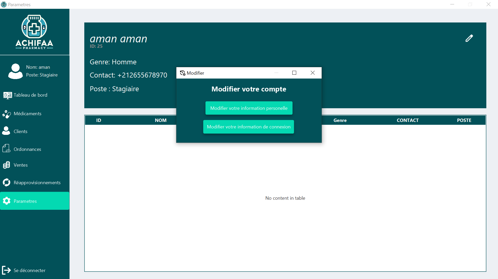
</div>
You can modify your personnalle info , alse u can modify your connection data as you can see:
<div align="center">
  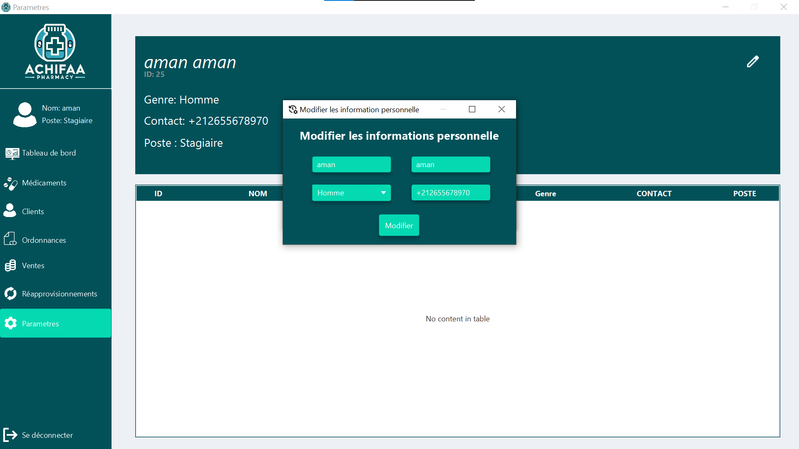
</div>
<div align="center">
  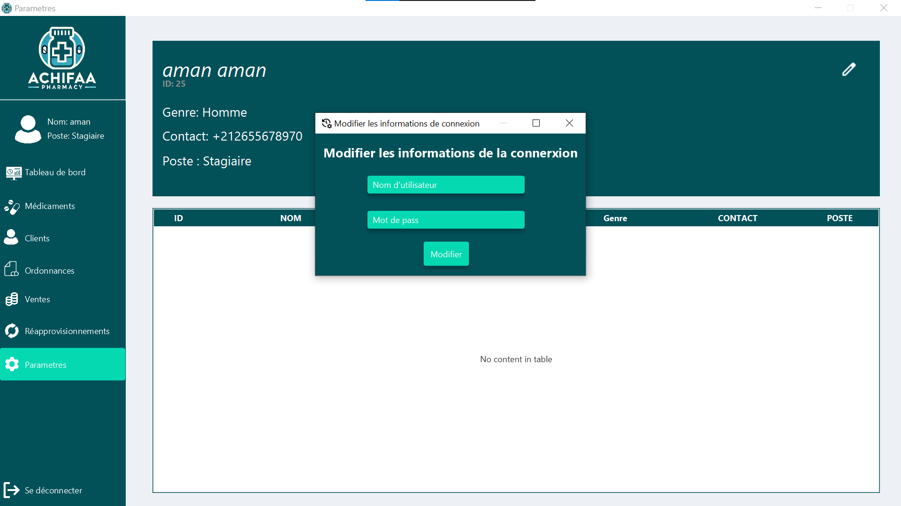
</div>

You maybe noticed that ther is no date showne in the table, this table is for the pharmacists management, the access for this page is for the admins , as u can see our user in this test is a "Stagiaire" so he can't access to this table.

But if we connect with an admin account:
<div align="center">
  
</div>
<div align="center">
  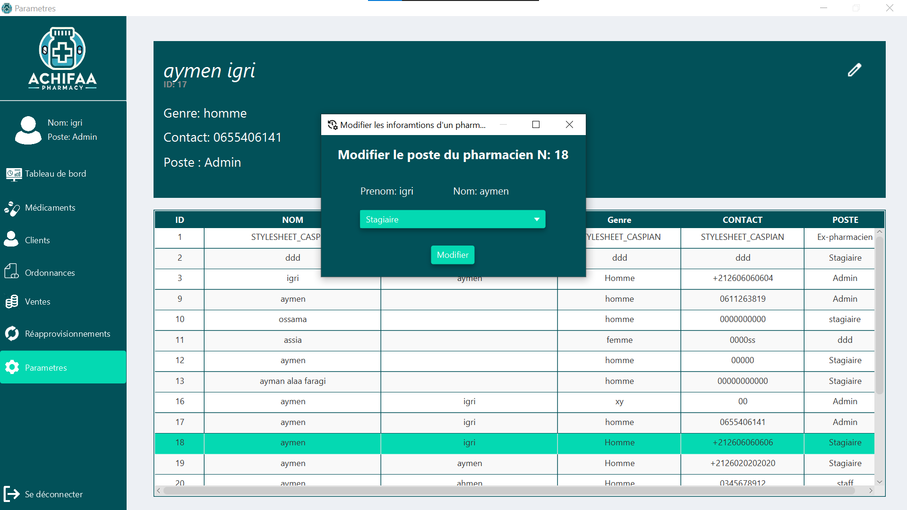
</div>

And you can logout using the button "Se déconnecter".

I hope this file was helpful.

Enjoy modifying in this project.

[Aymen Igri](https://www.linkedin.com/in/aymen-igri-8b6167304)